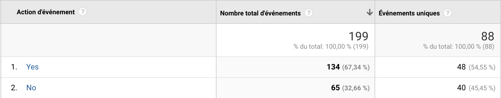
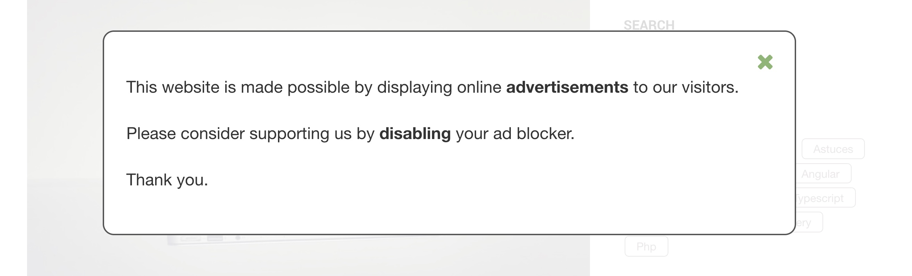
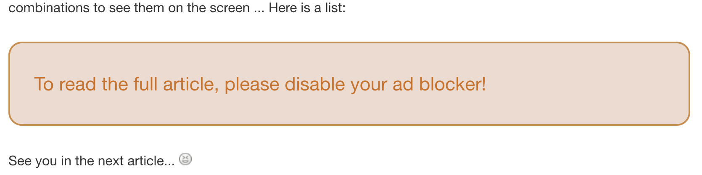

# Detect AdBlock Grav Plugin

The **Detect AdBlock** plugin is for [Grav CMS](http://github.com/getgrav/grav).

## Description

This plugin allow you to:
- detect ad blocker
- track user ads blocking status with Google Analytics



- manage user message with popup



- block reading of article by inserting inside message



This plugin works as an **anti-adblock** or just for **statistics**.

## Pre-requisites

If you want to manage Google Analytics, you shall include the snippets in your site:
  - Using your own integration (in theme or other)
  - Using Grav plugin [Google Analytics](https://github.com/escopecz/grav-ganalytics) by John Linhart.

To use *Detect AdBlock editor button*, you shall integrate **jQuery** v2.2.4 or upper.
  
## Installation

Installing the `Detect AdBlock` plugin can be done in one of two way: GPM (Grav Package Manager) installation method enables you to quickly and easily install the plugin with a simple terminal command, while the manual method enables you to do so via a zip file or GIT.
	
> NOTE: This plugin is a modular component for Grav which requires [Grav](http://github.com/getgrav/grav) to operate.

### GPM Installation (Preferred)

The simplest way to install this plugin is via the [Grav Package Manager [GPM](http://learn.getgrav.org/advanced/grav-gpm) through your system's Terminal (also called the command line). From the root of your Grav install type:

    $ bin/gpm install detect-adblock

This will install the `Detect AdBlock` plugin into your /user/plugins directory within Grav. Its files can be found under `user/plugins/detect-adblock`.

### Manual Installation (Download)

To install this plugin, just download the zip version of this repository and unzip it under `/your/site/grav/user/plugins`. Then, rename the folder to `detect-adblock`. You can find these files on [GitHub](https://github.com/clemdesign/grav-plugin-detect-adblock).

You should now have all the plugin files under

    /your/site/grav/user/plugins/detect-adblock

## Configuration

### 1. Code configuration

In your [theme](https://learn.getgrav.org/16/themes/theme-basics), add the following snippet:

```twig

```

> Add this snippet just after `<body>` integration, inside the tag.  
> `<body>` tag is generally defined in the `base.twig.html` template.


### 2. Parameters configuration

This plugin can be configured entirely by [Grav Admin plugin](https://github.com/getgrav/grav-plugin-admin).


#### 2.1. Common configuration

You can set-up the following common parameters:

```yaml
enabled: true           # If true, enable the plugin
ganalytics: true        # If true, manage Google Analytics tracking
```

#### 2.2. Popup Message

`Detect AdBlock` allow you to display a popup message that inform user that an ad blocker is detected.

You can, in choice:
- display a message and user can continue the visite by closing it.
- force user to disable the ad blocker to continue the visit.

There are the parameters:

```yaml
popup:
  message:
    enabled: true         # If true, display the popup message
    displayone: true      # If true, display the popup message only one times
    page_filter: ''       # List of page section where message shall be displayed (e.g.: blog, docs).
    content:              # Your message content in markdown format
  blockvisit:
    enabled: false        # If true, block the visit of user and force to disable ad blocker
    idtoremove: 'body'    # DOM Id to remove when visit is blocked.
```

When the `blockvisit.enabled` parameter is enabled, you can block the user to read content with **Code Inspector** tool or navigator.  
You shall define the parameter `blockvisit.idtoremove` with ID of DOM element container.

#### 2.3. Inside Message

`Detect AdBlock` is able to replace a page content by a message when ad blocker is detected.

This feature is usefull to force user to disable ad blocker to read full article.

When this option is enabled, it is prior on **Popup Message**.

The are the parameters:

```yaml
inside:
  blockreading:
    enabled: false            # Set to true to block reading of full article
    add_editor_button: true   # Set to true to add a button in editor to insert tags
    message:                  # Your replaced warning message 
```

### 3. Overwriting the message style

#### 3.1. Overwriting the template

The **Popup Message** is managed by the template `partials/detect-adblock-popup.html.twig`.  
You can overwrite this template in your theme, but be careful to:

- define the ` id="detect-adblock-popup"` for box wrapper of your message.
- add a close button with this action ` onclick="dabHide()"`.

The **Inside Message** is managed by the template `partials/detect-adblock-inside.html.twig`.
You can overwrite this template in your theme without restrictions.


#### 3.2. Overwriting the css style

You have possibility to overwrite the style of messages.
For that, you have the following CSS tag:

```css
/* For Popup Message */
.detect-adblock-popup {
    /* The global message wrapper, to manage background of message. */
}
.detect-adblock-popup .dab-message {
    /* The message container, to manage main message style. */
 }
.detect-adblock-popup .dab-message .dab-buttons {
    /* The message buttons container. */
}
.detect-adblock-popup .dab-message .dab-content {
    /* The message content container. */
}
/* For Inside Message */
.detect-adblock-inside { 
    /* The message container inserted in page */
}
```

### 4. Multi-language of message

Plugin allow you to define a multi-language message in plugin configuration page.

The displayed message use the parameter `popup.message.content` for **Popup Message** or `inside.blockreading.message` for **Inside Message**.

To define translation of your message, split the content with the tag `---{language key}---`.

The first block is considered as default language.

For instance:

```md
Default language of your message
---fr---
Message in French
---es---
Message in Spanish
---de---
Message in German
```

### 5. Google Analytics

This plugin doesn't embed the Google Analytics library/code. You shall do it in your theme or using a plugin (See chapter Pre-requisites).  

Notify to Google Analytics the blocking user status works if:
- the parameter `ganalytics` is enabled.
- `ga` object is defined OR
- `_gap` is defined

To get statistics in Google Analytics, refer to this page:  
[https://support.google.com/analytics/answer/1033068?hl=en](https://support.google.com/analytics/answer/1033068?hl=en)

# Contributing

If you think any implementation are just not the best, feel free to submit ideas and pull requests. All your comments and suggestion are welcome.

# Credits

This plugin is based on [Detect AdBlock](https://www.detectadblock.com/) solution.

# License

Copyright (c) 2019 [clemdesign](https://github.com/clemdesign).

For use under the terms of the [MIT](https://opensource.org/licenses/mit-license.php) license.